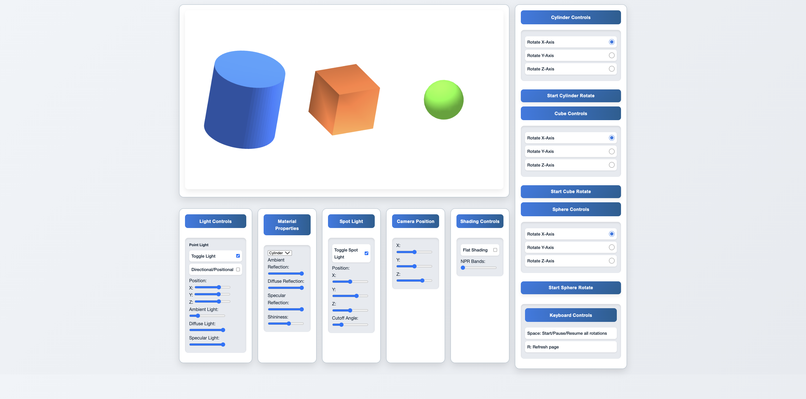

  # Lighting and Shading Animation

<a href="https://lithia22.github.io/CPC354_Assignment_2/" target="_blank">
  
</a>

Click on the image above to visit the project.

## How to Run the Project:

1. **Clone the Repository**

   ```bash
   git clone https://github.com/Lithia22/CPC354_Assignment_2.git
   ```

2. **Navigate to the project directory**
   
   ```bash
   cd CPC354_Assignment_2
   ```

3. **Open Live Server**
